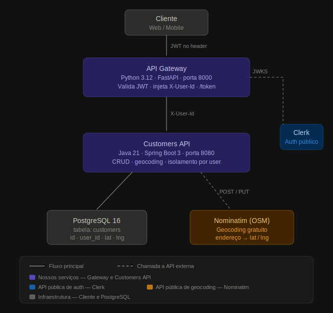

# GeoGateway

API Gateway do MVP de geração de rotas para entregas — PUC-Rio.

Este serviço é o **único ponto de entrada externo** da aplicação. Ele autentica o usuário via JWT (Clerk) e repassa as requisições para a [Customers API](../customers-api).

## Arquitetura



O MVP é composto por três camadas principais:

- **API Gateway (este serviço)** — recebe as requisições do cliente com um JWT no header, valida a assinatura junto ao Clerk via JWKS, extrai o `sub` do token e injeta como `X-User-Id`, e faz proxy para a Customers API
- **Customers API** — serviço Java/Spring Boot responsável pelo CRUD de clientes, geocodificação de endereços via Nominatim e isolamento de dados por usuário
- **Clerk** — provedor de autenticação externo; o Gateway consulta sua JWKS URL pública para validar os tokens, sem tráfego de credenciais privadas

## Tecnologias

- Python 3.12
- FastAPI
- httpx (proxy HTTP)
- python-jose (validação JWT RS256)
- Clerk (provedor de autenticação)

## Pré-requisitos

- Docker
- A [Customers API](../customers-api) rodando na porta `8080`

## Como executar

### 1. Configurar variáveis de ambiente

```bash
cp .env.example .env
```

Ajuste os valores em `.env` se necessário:

| Variável | Descrição |
|---|---|
| `CLERK_JWKS_URL` | URL pública de verificação JWT do Clerk |
| `CLERK_SECRET_KEY` | Secret key do Clerk (necessária para o endpoint `/token`) |
| `CUSTOMERS_API_URL` | URL base da Customers API (padrão: `http://localhost:8080`) |

### 2. Build da imagem

```bash
docker build -t geo-gateway .
```

### 3. Rodar o container

```bash
docker run -d --name geo-gateway -p 8000:8000 --env-file .env geo-gateway
```

> **Nota:** se a Customers API estiver rodando em outro container Docker, use `--network` ou ajuste `CUSTOMERS_API_URL` para o IP/hostname correto.

### 4. Acessar o Swagger

Abra no navegador: [http://localhost:8000/docs](http://localhost:8000/docs)

A autenticação é automática: basta executar o `POST /token` com um email de teste e todos os endpoints seguintes já estarão autenticados (sem precisar clicar em nenhum botão).

### 5. Parar o container

```bash
docker stop geo-gateway
```

## Endpoints

| Método | Rota | Descrição | Rota na Customers API |
|---|---|---|---|
| POST | `/api/customers` | Cadastrar novo cliente | `POST /customers` |
| GET | `/api/customers` | Listar clientes | `GET /customers` |
| GET | `/api/customers/{id}` | Buscar cliente por ID | `GET /customers/{id}` |
| PUT | `/api/customers/{id}` | Atualizar cliente | `PUT /customers/{id}` |
| DELETE | `/api/customers/{id}` | Remover cliente | `DELETE /customers/{id}` |

Todas as rotas exigem o header `Authorization: Bearer <JWT>`.

## Fluxo de Autenticação

```
Cliente envia requisição com Authorization: Bearer <JWT>
    │
    ▼
Gateway valida o JWT usando a JWKS URL do Clerk
    │
    ▼
Extrai o campo "sub" do payload (ex: user_2abc123xyz)
    │
    ▼
Injeta como header X-User-Id e repassa para a Customers API
    │
    ▼
Resposta retorna ao cliente sem modificação
```

## Passo a passo para testar (do zero)

Este guia cobre toda a subida do ambiente e testes de ponta a ponta.

### Pré-requisitos

- Docker instalado e funcionando (`docker --version`)
- Portas **8080** e **8000** livres

### 1 — Criar a rede Docker

Ambos os containers precisam se comunicar. Crie a rede compartilhada:

```bash
docker network create geoentregas
```

### 2 — Subir a Customers API

```bash
cd /caminho/para/customers-api

docker build -t customers-api .

docker run -d \
  --name customers-api \
  --network geoentregas \
  -p 8080:8080 \
  customers-api
```

Aguarde ~15 s para o PostgreSQL e a aplicação subirem. Verifique:

```bash
docker logs -f customers-api
```

Quando aparecer _"Started ClientesApiApplication"_, a API está pronta.

A documentação Swagger da Customers API estará em: [http://localhost:8080/swagger-ui.html](http://localhost:8080/swagger-ui.html)

### 3 — Configurar e subir o API Gateway

```bash
cd /caminho/para/geo-gateway

cp .env.example .env
```

Edite o `.env` e preencha com os valores reais (consulte o Clerk Dashboard):

```dotenv
CLERK_JWKS_URL=https://<seu-dominio>.clerk.accounts.dev/.well-known/jwks.json
CLERK_SECRET_KEY=sk_test_...
CUSTOMERS_API_URL=http://localhost:8080
```

Build e execução:

```bash
docker build -t geo-gateway .

docker run -d \
  --name geo-gateway \
  --network geoentregas \
  -p 8000:8000 \
  --env-file .env \
  -e CUSTOMERS_API_URL=http://customers-api:8080 \
  geo-gateway
```

> **Nota:** o `-e CUSTOMERS_API_URL=http://customers-api:8080` sobrescreve o valor do `.env` para usar o hostname do container na rede Docker.

Verifique:

```bash
docker logs geo-gateway
```

Deve exibir: _"Uvicorn running on http://0.0.0.0:8000"_

### 4 — Acessar o Swagger do Gateway

Abra no navegador: [http://localhost:8000/docs](http://localhost:8000/docs)

### 5 — Autenticar (automático via Swagger)

O Swagger possui **autenticação automática** — não há botão "Authorize". Basta executar o `POST /token` e o token é capturado e injetado em todas as requisições seguintes.

**Usuários de teste disponíveis:**

| Email | Descrição |
|---|---|
| `teste@teste.com` | Usuário de teste principal |
| `usuario@teste.com` | Segundo usuário (para testar isolamento de dados) |

#### Como autenticar

1. Abra [http://localhost:8000/docs](http://localhost:8000/docs)
2. Expanda **POST /token** → clique **Try it out**
3. Preencha o body:
   ```json
   { "email": "teste@teste.com" }
   ```
4. Clique **Execute**
5. Pronto! O badge no canto superior direito ficará **🔓 verde** indicando que você está autenticado

O Swagger passará a enviar o `Authorization: Bearer <token>` automaticamente em todas as requisições.

#### Badge de status

| Badge | Significado |
|---|---|
| 🔒 Vermelho | Não autenticado — execute `POST /token` |
| 🔓 Verde | Autenticado — token válido por 60 s |
| ⏳ Amarelo | Token expirando em 10 s — gere um novo |

> **Importante:** o JWT tem validade de **60 segundos**. Quando o badge ficar amarelo ou vermelho, execute `POST /token` novamente.

#### Via curl (alternativa)

```bash
curl -s -X POST http://localhost:8000/token \
  -H "Content-Type: application/json" \
  -d '{"email": "teste@teste.com"}'
```

Resposta:

```json
{
  "token": "eyJhbGciOiJSUzI1NiIs..."
}
```

### 6 — Testar os endpoints

> Certifique-se de que o badge está **🔓 verde** antes de testar. Se estiver vermelho, execute `POST /token` novamente.

#### 6.1 — Criar um cliente

**POST /api/customers**

O Swagger exibirá um formulário com os campos `name` e `address`. O `userId` é injetado automaticamente a partir do token JWT.

```json
{
  "name": "João Silva",
  "address": "Rua Marquês de São Vicente 225, Rio de Janeiro"
}
```

Resposta esperada — **201 Created**:

```json
{
  "id": "uuid-gerado",
  "userId": "user_3C8DoriZCOJ4K54PwOALq7ck4t2",
  "name": "João Silva",
  "address": "Rua Marquês de São Vicente 225, Rio de Janeiro",
  "lat": -22.9796815,
  "lng": -43.2331377,
  "createdAt": "2026-04-09T...",
  "updatedAt": "2026-04-09T..."
}
```

> Note que `lat` e `lng` são preenchidos automaticamente via geocodificação (Nominatim). O campo `userId` é extraído do JWT — não precisa ser informado.

#### 6.2 — Listar clientes

**GET /api/customers**

Retorna **200 OK** com um array dos clientes do usuário autenticado.

#### 6.3 — Buscar por ID

**GET /api/customers/{id}**

Use o `id` retornado na criação.

#### 6.4 — Atualizar cliente

**PUT /api/customers/{id}**

```json
{
  "name": "João da Silva",
  "address": "Av. Brasil 1000, Rio de Janeiro"
}
```

#### 6.5 — Remover cliente

**DELETE /api/customers/{id}**

Retorna **204 No Content**.

### 7 — Testar isolamento de dados por usuário

Para verificar se um usuário só vê seus próprios clientes:

1. No Swagger, execute `POST /token` com `{"email": "teste@teste.com"}` (badge fica 🔓 verde)
2. Crie um cliente via `POST /api/customers`
3. Execute `POST /token` novamente com `{"email": "usuario@teste.com"}` (troca de usuário automática)
4. Execute `GET /api/customers`
5. O resultado deve ser um **array vazio** `[]` — o segundo usuário não vê os clientes do primeiro

### 8 — Testar sem autenticação

Verifique que as rotas protegidas rejeitam requisições sem JWT:

```bash
curl -s -w "\nHTTP: %{http_code}\n" http://localhost:8000/api/customers
```

Resposta esperada — **401 Unauthorized**:

```json
{"detail": "Token ausente"}
```

### 9 — Parar e remover os containers

```bash
docker stop geo-gateway customers-api
docker rm geo-gateway customers-api
docker network rm geoentregas
```

### Resumo rápido de comandos

```bash
# Subir tudo
docker network create geoentregas
docker build -t customers-api /caminho/para/customers-api
docker run -d --name customers-api --network geoentregas -p 8080:8080 customers-api
docker build -t geo-gateway /caminho/para/geo-gateway
docker run -d --name geo-gateway --network geoentregas -p 8000:8000 \
  --env-file .env -e CUSTOMERS_API_URL=http://customers-api:8080 geo-gateway

# Gerar JWT e testar
TOKEN=$(curl -s -X POST http://localhost:8000/token \
  -H "Content-Type: application/json" \
  -d '{"email":"teste@teste.com"}' | python3 -c "import sys,json; print(json.load(sys.stdin)['token'])")

curl -s -H "Authorization: Bearer $TOKEN" http://localhost:8000/api/customers

# Derrubar tudo
docker stop geo-gateway customers-api
docker rm geo-gateway customers-api
docker network rm geoentregas
```

## Estrutura do Projeto

```
geo-gateway/
├── Dockerfile
├── requirements.txt
├── .env.example
├── .gitignore
├── main.py
├── auth/
│   ├── __init__.py
│   └── token.py
├── middleware/
│   ├── __init__.py
│   └── auth.py
└── proxy/
    ├── __init__.py
    └── customers.py
```
